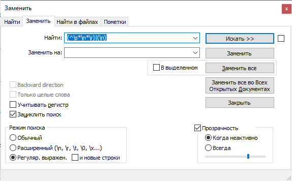
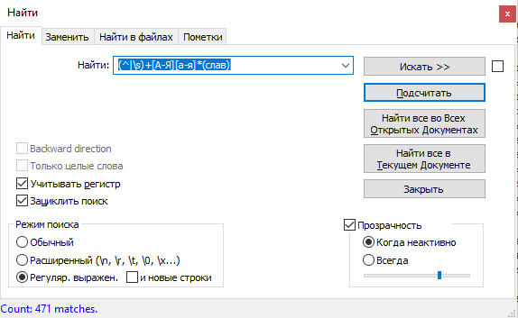
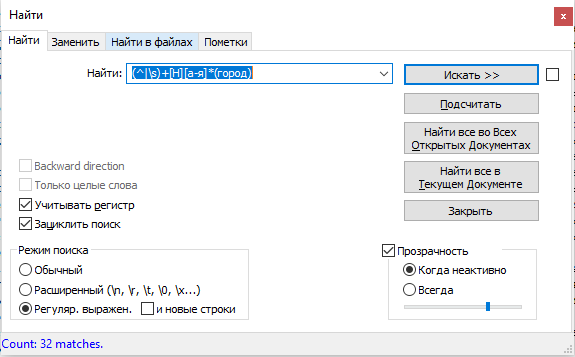

# hw9

Выполняла в Notepad++.

1. Использовала регулярное выражение: (^\s*\n*\r)|(\n) заменила все вхождения на пустую строку.

2. Использовала регулярное выражение: (^|\s)+[А-Я][а-я]*(слав) Всего упоминаний о князьях нашла: 471

3. Использовала регулярное выражение: (^|\s)+[Н][а-я]*(город) Всего упоминаний Новгорода нашла: 32

